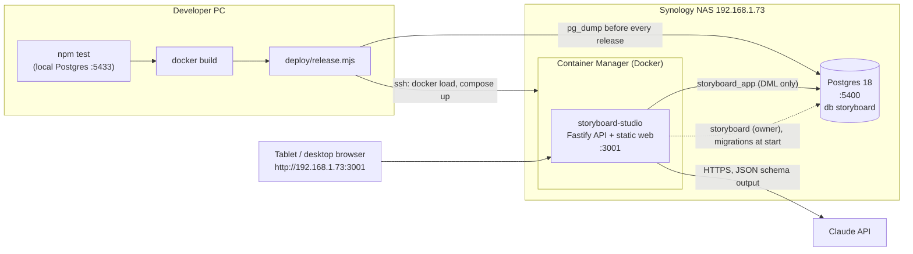
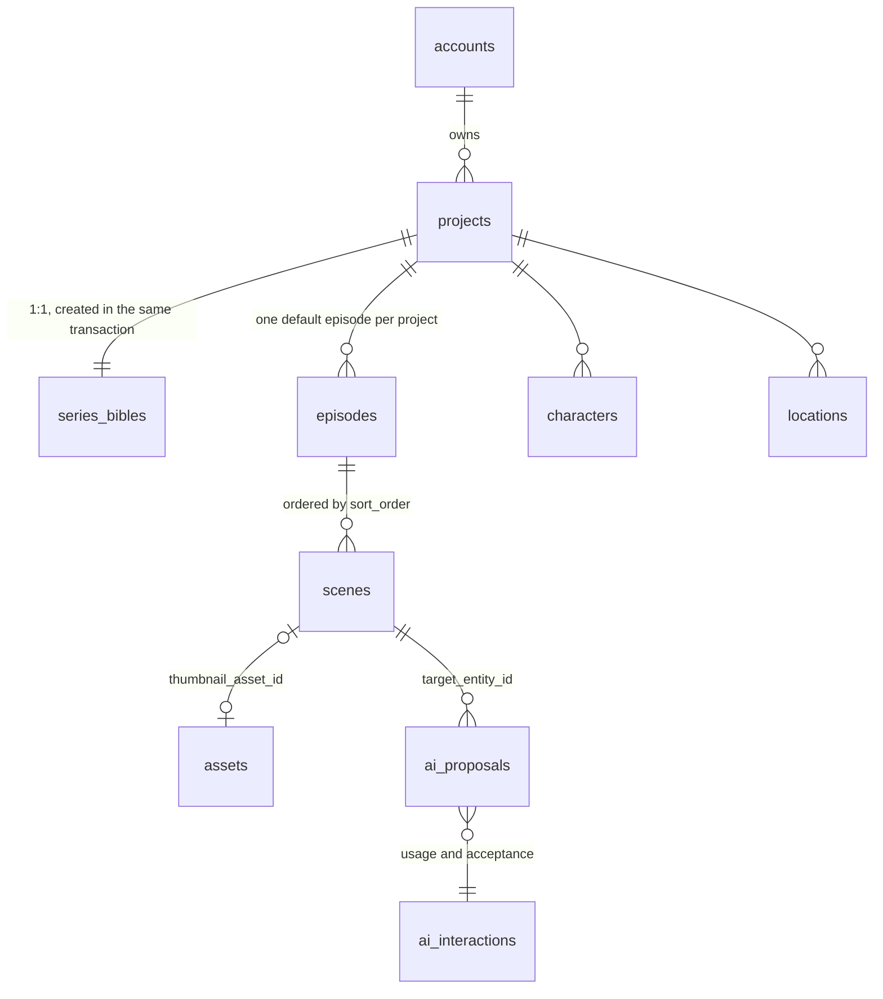
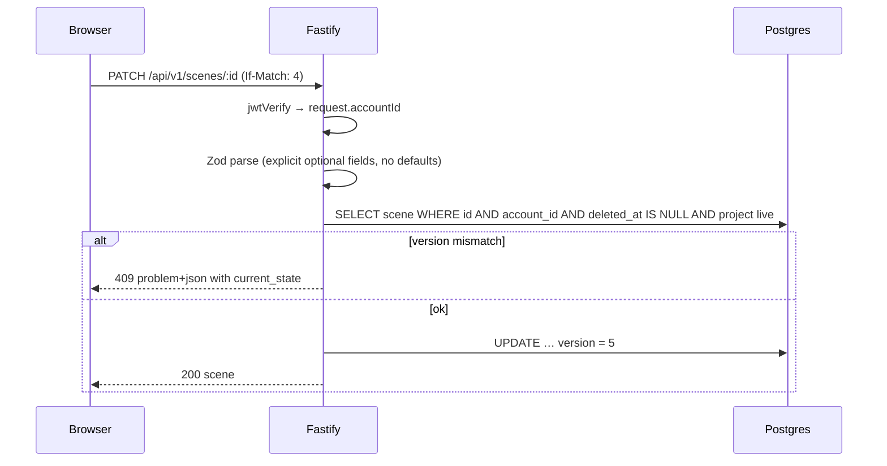
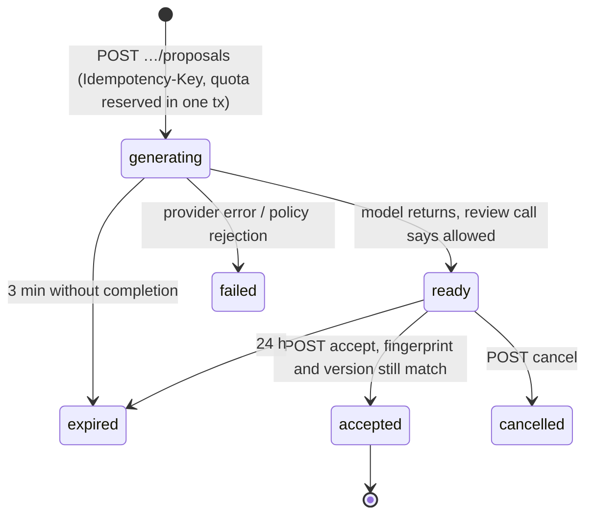
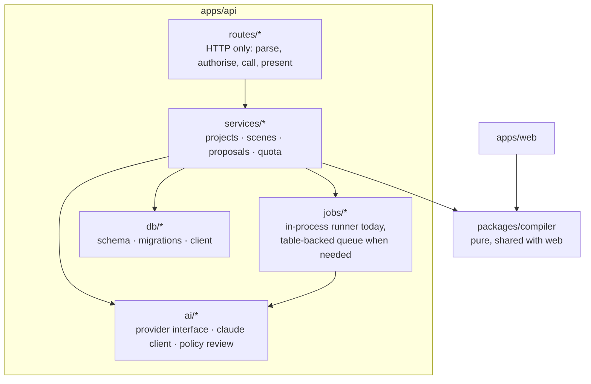

# Architecture: review and design

> **Current media architecture (27 September 2026):** see
> [the media-generation contract](media-generation-architecture.md) and
> [Character Studio delivery plan](character-studio-build-plan.md). The review below is dated
> 9 September; statements about missing jobs/providers/compiler describe that historical snapshot.
> Production media now already has a Postgres-backed job/ledger foundation to extend.

_Reviewed 9 September 2026 against the code as deployed to the home NAS._

This document has two halves. The first describes the system as it is and reviews it
honestly: what holds up, what is fragile, and what is missing. The second is the target
design, with the changes ordered so each one can ship on its own through `npm run release`.

## 1. The system today

### 1.1 Shape

One monorepo, three deployable pieces, one runtime container.

| Piece | Where | Notes |
|---|---|---|
| `packages/vocabularies` | `vocabularies.json` + generated TypeScript | The single authority for enum values and prompt phrases (CV-1). Codegen is checked in CI-style by `npm test`. |
| `apps/api` | Fastify 5, Drizzle, `postgres` driver, Zod 4 | Runs from TypeScript source under Node 24 type stripping. Serves the built web app in production. |
| `apps/web` | React 19, Vite 7, react-router 7, dnd-kit | Talks to the API with relative `/api/v1` URLs, so it works behind any host name. |
| `packages/compiler`, `packages/schema` | empty | Phase 2 placeholders; nothing imports them. |
| `infra/main.bicep` | Azure Container Apps + Postgres Flexible + Blob + Key Vault | Written in Phase 0, never deployed. The NAS is the live target. |

### 1.2 Domain model

Seventeen tables, every one carrying `account_id`. The ones in active use:

Shots, props, music cues, continuity flags, export packs, unmatched uploads and scene
versions exist in the schema but have no routes or UI yet.

Two rules run through everything:

- **Row-level isolation by construction.** Every query filters on the account id taken from
  the verified JWT, never from the request. Cross-account access is a 404, so an attacker
  cannot learn that a record exists.
- **Nothing the user makes is hard-deleted.** Projects and scenes carry `deleted_at`; every
  read filters it, restore endpoints put things back, and `?deleted=true` lists the bin.

### 1.3 Request lifecycle

Errors are always RFC 7807 `application/problem+json` with a stable `type`. The web client
turns them into typed `ApiProblem`s and shows `detail` in plain language.

### 1.4 AI path

The app never lets the model write to a domain record. A request creates an `AiProposal`
row with a fingerprint of everything the prompt was built from; the model runs in the
background; the user accepts or cancels; acceptance re-checks the fingerprint and version
so a stale suggestion cannot overwrite newer work.

Two model calls per request: one produces structured output (a sketch as shapes, or an
improved description) against a JSON schema; a second, independent call reviews the result
against the content policy before anything is shown. The teen account is always on the
constrained policy regardless of the project's audience (D16). Quotas are per account per
UTC day, reserved inside a `SELECT … FOR UPDATE` on the account row so two instances cannot
double-spend.

### 1.5 Deployment and operations

- **One image, one port.** The API serves `apps/web/dist` from the same origin, so there is
  no CORS configuration and no second container. Hashed assets are immutable-cached;
  `index.html` is `no-cache`, so a release is picked up on the next reload.
- **Two database roles.** `storyboard` owns the schema and runs migrations at container
  start; `storyboard_app` has DML only and is what the API holds. The migration credential
  is unset from the environment before the API process starts.
- **Release is a script, not a click-path.** `deploy/release.mjs` runs the tests, builds,
  dumps the database, streams the image over SSH into Container Manager's engine, replaces
  the compose project's file, recreates the container, then polls `/health` until it reports
  the new build tag and checks the served bundle hash. Rollback is re-tagging.
- **Backups** are `pg_dump` custom-format files, rotated, produced before every release and
  available as a nightly DSM scheduled task.

## 2. Review

### 2.1 What holds up

- **Isolation is structural, not procedural.** The `account_id` filter is in every query,
  the tests prove it against a real database, and the 404-not-403 rule is followed
  everywhere including restore endpoints.
- **The AI boundary is the right shape.** Proposals, fingerprints, idempotency keys, quota
  reservation in a transaction, a separate review call, and no reflection of upstream error
  bodies. This is more careful than most production systems.
- **Concurrency is handled where it matters.** `If-Match` on scene writes with a 409 carrying
  the server state; `FOR UPDATE` around quota and reorder; scene numbering recomputed
  server-side and never trusted from the client.
- **The vocabulary layer is enforced, not documented.** Editing a prompt phrase fails a test.
- **Operations are reproducible.** The image is built and tested on the PC, the NAS only ever
  receives a finished artefact, and the release proves what is live.
- **Errors talk to the user, not the developer.** Every 4xx says what to do next, in language
  a teenager can act on.

### 2.2 What is fragile

| # | Finding | Why it matters | Severity |
|---|---|---|---|
| R1 | **In-process background jobs.** Thumbnail and improvement generation run as promises inside the API process, tracked in a `Map`. A restart mid-generation leaves the proposal to expire after three minutes; a second instance would not see the first's jobs. | Fine for one container on one NAS. Blocks horizontal scaling and makes a deploy during generation a visible failure to the user. | Medium |
| R2 | **`proposal.id` is the client's `Idempotency-Key`.** The primary key of `ai_proposals` is chosen by the client. The route checks ownership, so it is safe, but it couples the wire contract to the storage key. | A future proposal type that is not client-initiated cannot reuse the table cleanly. | Low |
| R3 | **Two hard-coded accounts seeded from environment variables.** Passwords are scrypt hashes, which is fine, but any change to who can log in is a redeploy. There is no session revocation: a JWT is valid for 30 days after issue whatever happens. | Acceptable for two users in one house (plan D8). Not acceptable the day a third person is invited. | Medium (by design, tracked) |
| R4 | **No HTTPS.** The app is served over plain HTTP on the LAN. Passwords and tokens cross the home network in clear text, and the browser treats the origin as insecure (which already caused one bug: `crypto.randomUUID` missing). | Low risk on a private LAN, high risk the moment a port is forwarded. | Medium |
| R5 | **The `thumbnailRoutes` plugin is registered twice** (once per proposal kind), each with its own cleanup interval and its own `jobs` map. It works, but a reader has to notice the `kind` option to understand why. | Maintainability. | Low |
| R6 | **`routes/thumbnails.ts` is 280 lines doing four jobs**: context building, quota, job lifecycle, and accept/cancel. `context()` also reaches across to projects, accounts, characters and locations. | Every new AI operation will copy this file. | Medium |
| R7 | **The web client has no state layer.** Each screen fetches on mount and holds local state; there is no cache, so navigating back refetches, and a save on the scene page does not update the board until it reloads. | Fine at this size. Will hurt when the guided-path rail (D15) needs cross-screen state. | Low |
| R8 | **Migrations run on every container start with the owner credential in the environment.** The entrypoint unsets it before starting the API, so the running process never holds it, but the container's `docker inspect` output still shows it. | Anyone who can read container config on the NAS can read the owner password. On DSM that is any administrator, who could read `.env` anyway. | Low |
| R9 | **`infra/main.bicep` describes a deployment that does not exist**, and the README still leads with it. | Misleads the next reader about where the app runs. | Low (documentation) |
| R10 | **No automated browser tests** at the time of review. Drag-and-drop, the insecure-origin behaviour and the bin flows were verified by hand. | The `randomUUID` bug shipped because tests ran on `localhost`. Addressed in v0.3.0 by the Playwright suite the release runs on the LAN address (change B). | Medium, closed |
| R11 | **`packages/compiler` and `packages/schema` are empty directories** with no `package.json`. The workspace glob ignores them, but they suggest structure that is not there. | Confusing, harmless. | Low |
| R12 | **Scene deletion cancels pending AI proposals but restoring does not recreate anything**, and a restored scene's `thumbnail_source_fingerprint` may no longer match if siblings changed. | Correct (the thumbnail shows as stale), but worth a test. | Low |

### 2.3 What is missing against the plan

The build plan's Phase 2 (prompt compiler), Phase 1 (bible and cast UI), exports, shots and
continuity checks are all unbuilt. The scene editor and thumbnails were pulled forward because
they are what a teenager touches first. That ordering was the right call; the compiler still
depends on the Phase −1 spike that needs a person at an image tool for an afternoon.

## 3. Target design

### 3.1 Principles (unchanged)

1. The audience is a 10–15 year old; every string and every error is written for them.
2. Vocabularies are the single authority for anything that reaches a prompt.
3. The compiler is pure; the server is the sole compilation authority.
4. AI proposes, the user disposes. No model output touches a domain row without an accept.
5. `account_id` on every table, in every query; 404 not 403.
6. Nothing the user makes is hard-deleted.
7. Build and test on the PC; ship an artefact; prove what is live.

### 3.2 Target shape

The shape does not change. One container, one external Postgres, one release script. What
changes is what lives inside the API, and how the pieces are separated so the next three
features (compiler, bible and cast, exports) do not each re-invent the AI and persistence
plumbing.

### 3.3 Changes, in the order they should ship

Each is a release on its own. None changes the wire contract the web app depends on.

**A. Split the proposal machinery out of the routes (addresses R5, R6, R2).**
Move context building into `services/proposals/context.ts`, quota into
`services/proposals/quota.ts`, the job map and `generate()` into `jobs/runner.ts`, and the
accept/cancel transaction into `services/proposals/resolve.ts`. `routes/thumbnails.ts`
becomes two thin route files, one per proposal kind, both calling the same service with a
`ProposalKind` descriptor `{ operation, provider, apply(tx, scene, payload) }`. Keep
`ai_proposals.id = Idempotency-Key` for now but add a `request_key` column in the same
migration so a later change is data-only.

**B. Playwright suite on the LAN address (addresses R10). Done in v0.3.0.**
`apps/web/e2e`: ten flows against a container started from the freshly built image, reached
via the PC's LAN IP so the origin is insecure like the NAS: sign-in for both accounts, create
cartoon and scenes, arrow and real-pointer drag reorder, edit and save with the version,
both bins, account privacy, the AI-disabled message, and the tablet-app download link.
`release.mjs` runs it after the unit tests and refuses to ship on failure. Still open: an
"Improve" flow with a stubbed provider, which needs a test-only provider switch in the API.

**B2. Fire HD 10 app. Done in v0.3.0.**
`apps/android` is a landscape WebView shell around the served web app: icon, splash, native
`confirm()` dialogs, back navigation, offline screen, in-app server address. It is built and
signed by the release and served at `/downloads/bunny-studios.apk`. Chosen over a Trusted
Web Activity (needs Chrome and Play services, absent on Fire OS) and over Capacitor (would
bundle the web assets and need CORS plus an APK per web change). The wrapper only changes
when the wrapper itself changes; every server release updates the tablet.

**C. HTTPS at the NAS (addresses R4).**
DSM's reverse proxy with a Let's Encrypt certificate on a real host name, or DSM's own
self-signed certificate installed on the two tablets. The app already sets `trustProxy` in
production and uses relative URLs, so nothing in the code changes. `APP_URL` in
`release.env` moves to the HTTPS name. The `uuid.ts` fallback stays, because the IP address
will still work.

**D. Table-backed job queue (addresses R1).**
Only when either of these happens: a second container, or a user complaint about a preview
lost across a release. Design: `ai_proposals` already is the queue; add a `claimed_by` and
`claimed_at` pair, have the runner `UPDATE … WHERE state='generating' AND claimed_by IS NULL
RETURNING` to take work, and treat a claim older than the timeout as free. No new
infrastructure, and the existing expiry sweep already handles crashes.

**E. Real accounts (addresses R3).**
The login screen swap the plan describes: an `invitations` table, Argon2id hashing (replacing
scrypt, one file), refresh tokens with a `sessions` table so sign-out and revocation work,
and the seed step deleted. The teen's `is_minor` remains a property of the account, set by
the inviting adult, never by the teen.

**F. Prompt compiler (Phase 2, after the spike).**
`packages/compiler` gets a `package.json`, a pure `compile(bible, scene, shot) → string`
with a golden-file test set, and is imported by the API for exports and by the web app for
live preview only. The server remains the only place a compiled prompt is stored.

**G. Documentation and dead weight (addresses R9, R11).**
Move `infra/main.bicep` to `infra/azure/` with a one-line README saying it is a design, not a
deployment; delete the empty `packages/schema`; keep `packages/compiler` only with its
`package.json` from step F.

### 3.4 What is deliberately not changing

- **No second container, no message broker, no object storage.** Thumbnails are small SVGs
  stored in Postgres; Blob storage waits for user uploads.
- **No client state library.** The screens are few and independent. Revisit with the guided
  rail (D15).
- **No move away from running TypeScript from source.** Type stripping has been reliable;
  the constraints (no parameter properties, no enums) are documented and cheap.
- **No Azure deployment.** The NAS is the target for the foreseeable future. The Bicep file
  stays as a record of the intended cloud shape.

### 3.5 Threat model summary

| Asset | Threat | Control today | Gap |
|---|---|---|---|
| Teen's writing and drawings | Another account reads them | `account_id` on every query; 404 on miss; tested | None |
| Claude API key | Leaks to client or logs | Server-only, never in the bundle, upstream bodies never reflected | None |
| Database owner credential | Read from container config | Unset before the API starts; role limited to one database | Visible to DSM administrators (R8) |
| Session token | Sniffed on the LAN | None (HTTP) | C: HTTPS |
| Session token | Used after device loss | 30-day expiry only | E: sessions and revocation |
| Model output | Inappropriate content shown to a minor | Constrained policy always on for the teen, plus an independent review call, plus user accept | None |
| Prompt injection via scene text | Model follows instructions in user data | Data passed as JSON, system prompt says it is untrusted, review call is separate | Keep re-testing as prompts change |

## 4. Decision log additions

| # | Decision | Rationale |
|---|---|---|
| D19 | Single container serves API and web from one origin | Removes CORS and a second container on a home NAS; same-origin cookies later become possible. |
| D20 | Two Postgres roles, migrations as owner at container start | Least privilege for the running API without an external migration step. |
| D21 | Logical delete for projects and scenes, with restore | A teenager's work must survive a mis-tap. Storage cost is negligible. |
| D22 | Release by push over SSH from the developer PC, verified by build tag | The NAS never builds or tests; a release is proven live or fails loudly. |
| D23 | Backups are `pg_dump` custom format, one before every release, nightly on the NAS | Restore table-by-table if needed; the release can always be undone with data. |
| D24 | One semantic version in the root `package.json`, stamped as `v<version>-<commit>` on the image and reported by `/health` | A human version for people, a commit for exactness, one source for both. |
| D25 | Migrations are additive only | Rolling the app back never requires rolling the database back, so `--rollback` is a re-tag and a restart. |
| D26 | Changes reach `main` by pull request with a CI check; releases are pushed from the maintainer's machine, never from CI | The NAS is never exposed to the internet, and a red check blocks a release before it starts. |
