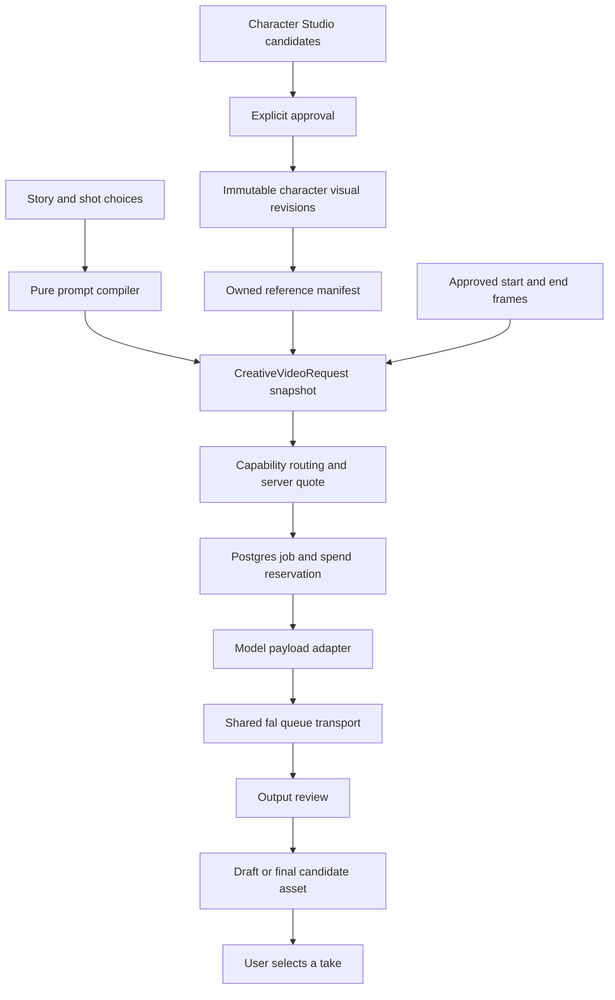

# Story-aware media generation — architecture contract

27 September 2026. Target architecture for [Character Studio requirements](character-studio-requirements.md). This describes the intended contract, not a claim that every component has shipped.

## Preserve the existing domains

The repo already has `characters`, `assets`, `shots`, `generation_jobs`, `generation_ledger`, a Postgres-backed runner and a fal queue adapter. The pasted proposal's `media_generations` describes a responsibility already substantially held by `generation_jobs`; extend that table rather than introducing a competing queue. `ai_proposals` remains responsible for proposed changes to story/domain data.



## Proposed schema additions

All new records carry `account_id`; routes check project/shot ownership as well as individual asset ownership. Names below are implementation targets, subject to migration review; responsibilities and invariants are normative.

| Record | Additions / responsibility |
|---|---|
| `characters` | Keep the existing ID and trait fields. Add optimistic edit version and current approved visual revision ID. New drafts do not mutate the selected approved revision. |
| `character_visual_versions` | Character ID, monotonic visual version, immutable approved trait/style snapshot, approval timestamp and actor. Unique `(character_id, visual_version)`. The selected pointer changes; approved contents do not. |
| `character_reference_candidates` | Character ID, source generation/upload asset, proposed view role, source look/fingerprint and review/approval state. Generated candidates can be replaced or rejected without changing canonical identity. |
| `character_visual_references` | Visual revision ID, owned asset ID, content hash, role, stable order and main-image designation. One main image; one asset can have multiple explicitly recorded uses. Referenced bytes are immutable. |
| `shot_character_bindings` | Shot ID, character ID, pinned visual revision and approved outfit selection. Explicit user acceptance governs updates to current looks. |
| Existing assets | Preserve storage/MIME/kind. Add usage-role associations as needed rather than forcing one file to have exactly one role. Keep moderation state separate from user approval. |
| Existing `generation_jobs` | Add/structure snapshot version, task, generation group, parent job, draft/final intent, next poll time, submission attempt state and provider draft metadata. Existing claims, attempts, statuses and provider IDs are reused. |
| Existing ledger | Extend price/configuration snapshot, provider currency/estimated amount, conversion revision and actual-cost knowledge. Preserve integer account-currency reservation and existing history. |

Migration is additive: create supporting tables/nullable columns, backfill legacy references as awaiting confirmation, deploy compatible reads, then enforce new-write invariants. Old jobs without visual revisions remain readable and are labelled legacy; never fabricate a canonical revision for them. Soft deletion must not remove bytes required by retained job history.

## Request boundary

The application request contains asset IDs. The runner resolves bytes or temporary delivery URLs only after ownership, approval and media validation. Provider field names never become Shot/Character fields.

```ts
interface CreativeVideoRequest {
  schemaVersion: 1;
  shotId: string;
  task: 'text-to-video' | 'image-to-video' | 'reference-to-video';
  intent: 'draft' | 'final';
  prompt: string; // server compiled; retained with compiler version
  compilerVersion: string;
  startFrameAssetId?: string;
  endFrameAssetId?: string;
  references: ReferenceBinding[];
  characters: Array<{ characterId: string; visualVersionId: string; outfitId?: string }>;
  output: { durationSeconds: number; resolution: string; aspectRatio: string; audio: boolean };
}

interface ReferenceBinding {
  assetId: string;
  contentHash: string;
  modality: 'image' | 'video' | 'audio';
  role: 'character' | 'style' | 'location' | 'prop' | 'motion' | 'voice';
  characterVisualVersionId?: string;
  position: number;
}
```

This is the target persisted contract; the current `apps/api/src/video/creativeVideoRequest.ts` is a smaller runner-facing foundation. Snapshot serialization, asset resolution and adapter payload types remain distinct. Store endpoint, adapter version, random seed, resolved options and quote alongside the creative snapshot. Reproducibility means preserving inputs and provenance, not guaranteeing identical provider output.

## Code ownership

| Concern | Location / boundary |
|---|---|
| Catalogue and capability types | `packages/models/models.json`, generated types and registry; no duplicate family registry in React |
| Canonical character operations | Existing `routes/cast.ts`, Character service and additive DB migrations |
| Compilation | `packages/compiler` and `shots/sync.ts`; pure compiler, server-authoritative assembly |
| Creative request and routing | `apps/api/src/video/`; validated task/intent, references and compatible endpoint selection |
| Payload adapters | `apps/api/src/video/adapters/`; existing flat catalogue adapter plus dedicated implementations where schemas differ materially |
| Provider transport | Existing `generation/fal.ts`: submit, poll, fetch and cancel; shared across families |
| Money | Existing `generation/budget.ts` plus shared model quote calculator |
| Durable orchestration | Existing `jobs/runner.ts`; no model-name conditionals |
| UI | Existing Cast sheet/Studio components, shared Director editor and Advanced grouped picker |

An adapter receives a resolved creative request and model definition, validates its exact schema, emits a provider payload, and normalizes files plus metadata such as seed/draft ID. Mapping-only endpoints share code. Distinct files for every family are optional; independently testable contracts are mandatory.

The registry must eventually support reference limits by modality and aggregate, task-specific durations, resolution/FPS constraints, optional versus mandatory audio, draft-promotion semantics and model-specific price strategies. Advertise only capabilities actually wired through the whole application. Provider support for 50 mixed inputs does not mean our upload, review and pricing paths support 50 inputs yet.

## Reliability and money

Use the existing Postgres claim/lease runner with durable poll scheduling. Fence state transitions to the current claim; a stale worker must not settle a job after another worker reclaims it. Persist every part/provider request ID. Record the submission ambiguity window explicitly: local idempotency alone cannot guarantee exactly one remote charge.

A generation-group parent links drafts and finals but does not share a spend reservation. Each paid attempt has its own quoted, reserved ledger entry. Quote revision/configuration is validated again at submit; a stale changed-price quote must be refreshed visibly. Actual cost is nullable and qualified by provenance. Refund policy distinguishes work not submitted, confirmed provider refunds and submitted work whose cost remains unknown.

Keep current input/provider/output safety gates and user approval independent. Candidate assets do not become canonical on successful moderation alone. Compile and review adapter-added reference bindings before submission. A provider or model change must not weaken the account policy or drop required references.

## Draft/final semantics

Native promotion uses saved provider draft metadata and a valid, separately quoted completion operation. Cross-model final rendering reuses the creative snapshot but creates a new take. Duration, sound, frames and references are revalidated against the final endpoint; lost capabilities are never silently omitted. Final-generation failure leaves the selected draft intact.
